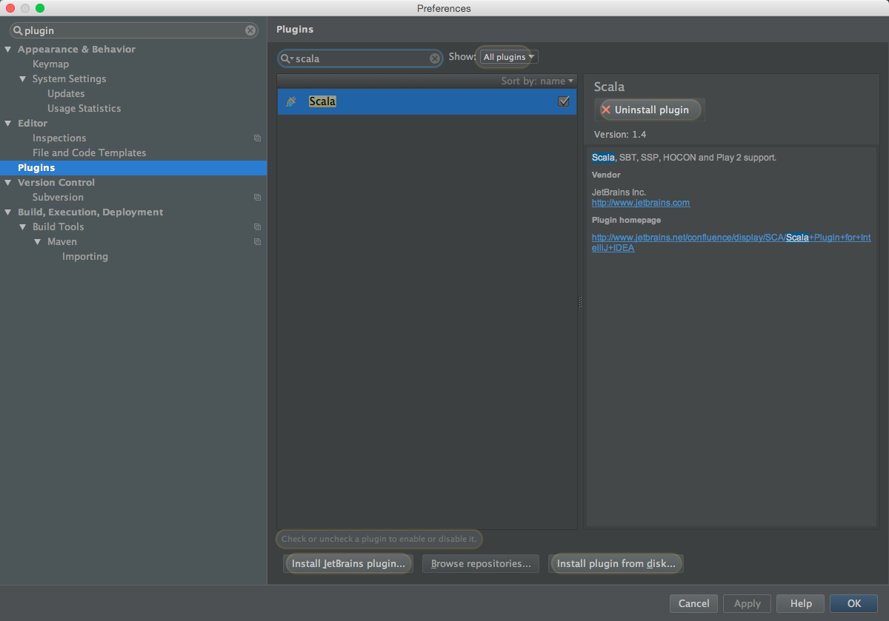
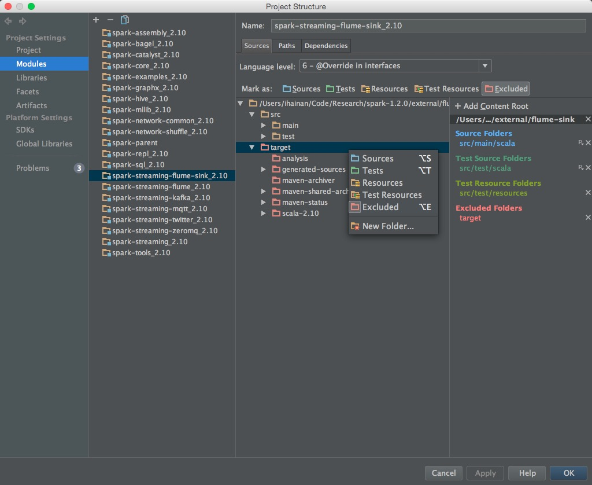
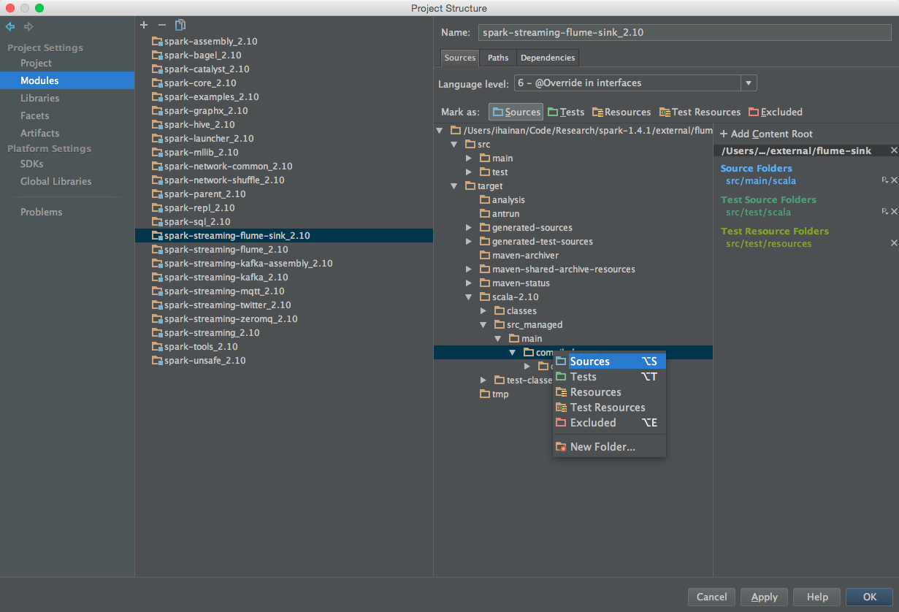
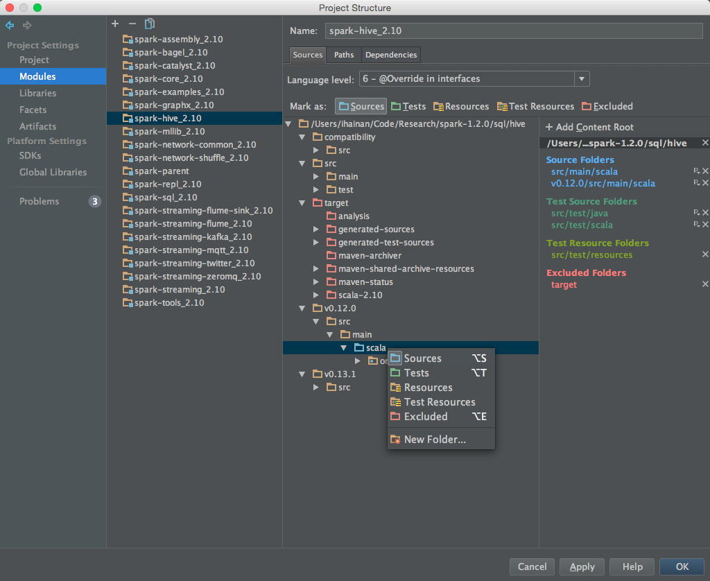
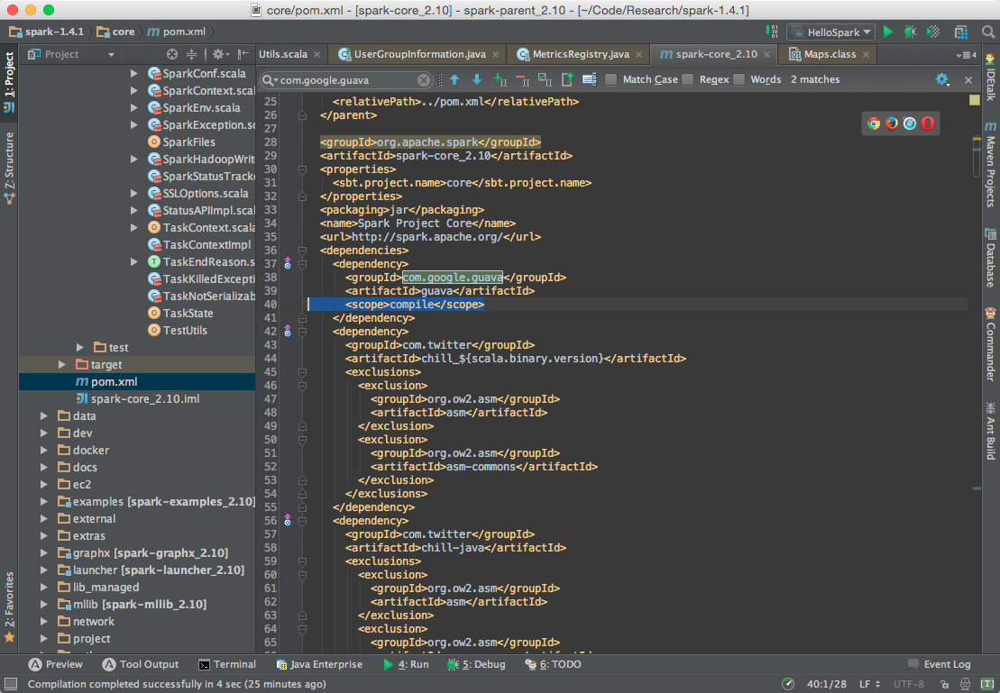
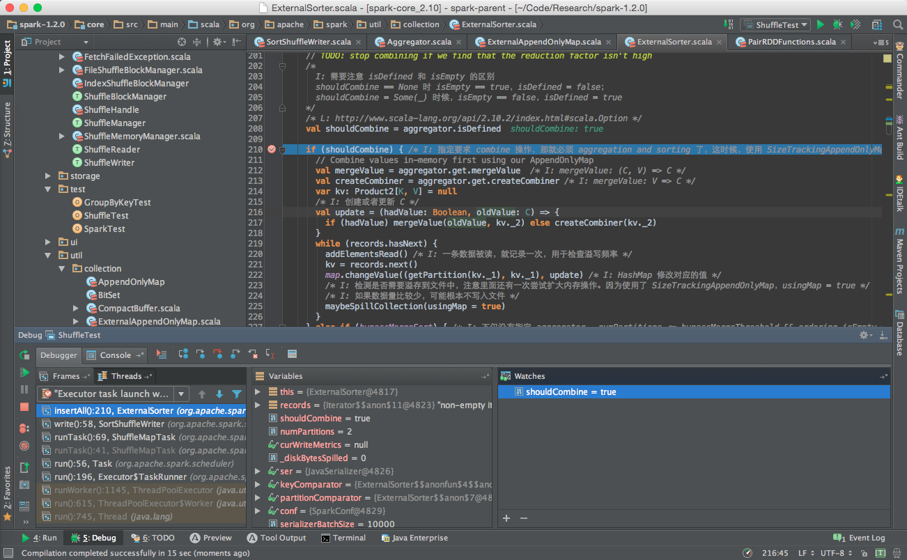

# Apache Spark 源码阅读

## Overview
本文档是我去年（2014）年末学习 [Apache Spark](http://spark.apache.org/) 源码时所留下的阅读笔记，原为 Microsoft Word 文档。近期出于毕业求职需要，重温源码，顺带整理了下原文档，转换成 Markdown 文档，修正原文中出现的一些错误，对缺漏之处也做了相应补全。整理过后的文档会放在我的 [Github 仓库](https://github.com/ihainan/SparkInternals) 和 [GitBook](http://ihainan.gitbooks.io/spark-source-code/content/) 上。

__本文档对应的 Apache Spark 源码版本为 {{book.sparkVersion}}__。代码仓库中，不同分支表示不同版本的 Spark。

本人经验、能力以及实验条件实在是有限，在研究过程中难免会有诸多不足。若在阅读本文档时发现有错误与遗漏之处，还望能够提出指正。

## How to Read

在学习过程中，Matei Zaharia 发表的论文 ___Resilient Distributed Datasets: A Fault-Tolerant Abstraction for In-Memory Cluster Computing___ 和他的博士毕业论文 ___An Architecture for Fast and General Data Processing on Large Clusters___ ，Jerry Lead 关于 Apache Spark 内部机制的[系列文章](https://github.com/JerryLead/SparkInternals)，ColZer 关于 Apache Spark 的 [学习笔记](https://github.com/ColZer/DigAndBuried)，等等文章资料都给了我相当多的帮助。在阅读本系列文章时，我十分推荐配合上面几篇材料一起学习，不同文章解析 Apache Spark 的角度各不相同，相信都会对你有所启发。

搭配 IntelliJ IDEA + Apache Spark {{book.sparkVersion}} 源码阅读本文档味道更佳。具体配置步骤如下：

- __下载并解压缩 Apache Spark {{book.sparkVersion}} 源码__

源码下载地址[点此](http://spark.apache.org/downloads.html)，在选择 Package Type 时候需要注意选择 __Source Code（can build several Hadoop Version）__。

- __编译 Apache Spark {{book.sparkVersion}} 源码__

依照官方文档 [Build Spark - Spark {{book.sparkVersion}} Documentation](https://spark.apache.org/docs/{{book.sparkVersion}}.0/building-spark.html) 所述步骤和参数，在命令行下编译 Apache Spark {{book.sparkVersion}} 的源码，也可以参考文档 [Useful Developer Tools - Spark](https://cwiki.apache.org/confluence/display/SPARK/Useful+Developer+Tools#UsefulDeveloperTools-IntelliJ) 中的方法直接在 IDE 中编译，本文采用前一种方法，编译和下载依赖的时间会比较长，我在一个全新的系统中编译整套源码用了将近一小时半的时间。

- __IntelliJ IDEA 安装 Scala 插件__

依次选择 Preferences -> Plugins -> Install JetBrains plugin。搜索框输入 scala，右侧点击 Install Plugin，安装成功后重启 IntelliJ IDEA。

- __IntelliJ IDEA 导入 Apache Spark {{book.sparkVersion}} 源码__

使用 IntelliJ IDEA 打开 Apache Spark {{book.sparkVersion}} 源码目录下的 pom.xml 文件。

导入项目完成后，依次打开 Project Structure -> Modules -> spark-streaming-flume-sink.2.10，右键 target 目录，取消 Excluded 标签。

展开到 target -> scala-2.10 -> src_managed -> main -> compiled_avro 目录，右键，标记为 Source 目录。

同样，将 spark-hive\_2.10 模块内的 v0.13.1 -> src -> main -> scala 目录标记为 Source 目录。

（__1.4 之前版本无需此操作__）编辑 pom.xml 文件，定位到如下位置，添加 `<scope>compile</scope>`，否则会出现能够顺利编译，运行时抛出异常 `NoClassDefFoundError` 的情况。

点击 Build -> Rebuild Project，等待项目构建完成即可。

- __编写测试程序，调试__

我对源码的注释放在[此处](https://github.com/ihainan/CodeSnippets/tree/master/Apache%20Spark/sparkInternals/spark-1.2.0)，里面还包含了一些测试用的[程序](https://github.com/ihainan/CodeSnippets/tree/master/Apache%20Spark/sparkInternals/spark-1.2.0/core/src/main/scala/org/apache/spark/test)。其中一些标记符号的含义如下：

	I: Info，表信息，是我对代码的理解。
	Q: Question，表问题，指我对代码的一些疑惑之处。
	L: Link，表链接，附上一些有用的参考连接。
	T: Test，表测试。
	R: Result，表测试结果。

## LICENSE
Licensed [BY-NC-SA Creative Commons](http://creativecommons.org/licenses/by-nc-sa/4.0/). 

## Author
[@ihainan](http://github.com/ihainan)
