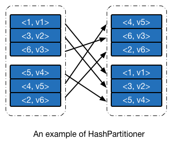
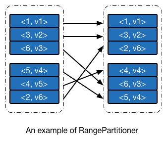

# 分区器

## RDD 分区器
__分区器（Partitioner）__在前面章节中或多或少有所提及。我总结了 RDD 分区器的三个作用，而这三个影响在本质上其实是相互关联的。

1. 决定 Shuffle 过程中 Reducer 的个数（实际上是子 RDD 的分区个数）以及 Map 端的一条数据记录应该分配给哪一个 Reducer。这个应该是最主要的作用。
2. 决定 RDD 的分区数量。例如执行操作 `groupByKey(new HashPartitioner(2))` 所生成的 `ShuffledRDD` 中，分区的数目等于 2。
3. 决定 `CoGroupedRDD` 与父 RDD 之间的依赖关系。这个在依赖小节说过。

由于分区器能够间接决定 RDD 中分区的数量和分区内部数据记录的个数，因此选择合适的分区器能够有效提高并行计算的性能（回忆下分区小节我们提及过的 `spark.default.parallelism` 配置参数）。Apache Spark 内置了两种分区器，分别是__哈希分区器（Hash Partitioner）__和__范围分区器（Range Partitioner）__。

开发者还可以根据实际需求，编写自己的分区器。分区器对应的源码实现是 `Partitioner` 抽象类，`Partitioner` 的子类（包括自定义分区器）需要实现自己的 `getPartition` 函数，用于确定对于某一特定键值的键值对记录，会被分配到子RDD中的哪一个分区。

``` scala
/**
 * An object that defines how the elements in a key-value pair RDD are partitioned by key.
 * Maps each key to a partition ID, from 0 to `numPartitions - 1`.
 */
abstract class Partitioner extends Serializable {
  def numPartitions: Int
  def getPartition(key: Any): Int
}
```

## 哈希分区器
哈希分区器的实现在 `HashPartitioner` 中，其 `getPartition` 方法的实现很简单，取键值的 hashCode，除以子 RDD 的分区个数取余即可。 

``` scala
/**
 * A [[org.apache.spark.Partitioner]] that implements hash-based partitioning using
 * Java's `Object.hashCode`.
 *
 * Java arrays have hashCodes that are based on the arrays' identities rather than their contents,
 * so attempting to partition an RDD[Array[_]] or RDD[(Array[_], _)] using a HashPartitioner will
 * produce an unexpected or incorrect result.
 */
class HashPartitioner(partitions: Int) extends Partitioner {
  def numPartitions: Int = partitions

  def getPartition(key: Any): Int = key match {
    case null => 0
    case _ => Utils.nonNegativeMod(key.hashCode, numPartitions)
  }

  override def equals(other: Any): Boolean = other match {
    case h: HashPartitioner =>
      h.numPartitions == numPartitions
    case _ =>
      false
  }

  override def hashCode: Int = numPartitions
}
```

使用哈希分区器进行分区的一个[示例](https://gist.github.com/909a84585f1957144eaf.git) 如下图所示。此例中整数的 hashCode 即其本身。



## 范围分区器

哈希分析器的实现简单，运行速度快，但其本身有一明显的缺点：由于不关心键值的分布情况，其散列到不同分区的概率会因数据而异，个别情况下会导致一部分分区分配得到的数据多，一部分则比较少。范围分区器则在一定程度上避免这个问题，__范围分区器争取将所有的分区尽可能分配得到相同多的数据，并且所有分区内数据的上界是有序的__。使用范围分区器进行分区的一个[示例](https://gist.github.com/ihainan/909a84585f1957144eaf) 如下图所示。

如果你自己去测试下面这个例子的话，会发现键值 4 被分配到子 RDD 中的第一个分区，与下图并不一致，这是因为 Apache Spark 1.1 及之后的版本，划分分区边界时候用的是 `>` 而不是 `>=`，后文会细述相应的代码实现。我已经向 Apache Spark 提交了 [JIRA](https://issues.apache.org/jira/browse/SPARK-10184) 和 [PR](https://github.com/apache/spark/pull/8397)。



范围分区器需要做的事情有两个：__根据父 RDD 的数据特征，确定子 RDD 分区的边界__，以及__给定一个键值对数据，能够快速根据键值定位其所应该被分配的分区编号。__

如果之前有接触过 Apache Hadoop 的 [TeraSort](http://dongxicheng.org/mapreduce/hadoop-terasort-analyse/) 排序算法的话，应该会觉得范围分区器解决的事情与 TeraSort 算法在 Map 端所需要完成的其实是一回事。两者解决问题的思路也是十分类似：对父 RDD 的数据进行__采样（Sampling）__，将采样得到的数据__排序__，并分成 M 个数据块，__分割点的键值作为后面快速定位的依据__。尽管思路基本一致，但由于 RDD 的一些独有特性，在具体的实现细节上，范围分区器又与 TeraSort 算法有许多不同之处。

### 1.1 版本之前的范围划分方法
Apache Spark 在 1.1 及之后版本对范围分区器的范围划分算法做了一次比较大的更新（参见 [2e6efca](https://github.com/apache/spark/commit/2e6efcacea19bddbdae1d655ef54186f2e52747f)）。在具体解读 {{book.sparkVersion}} 版本范围分区器的实现之前，我们最好先研究下 1.0 版本是如何进行范围划分的，以便更好地理解新版本如此设计的意义所在。

#### 样本总量
首先我们需要考虑的问题是：总共采样多少数据更合适。样本总量少了，划分得到的范围边界不够具有代表性，样本总数大了，采样、排序的时间会随之增加。Apache Spark 选择的采样总量 `maxSampleSize` 由子 RDD 的分区个数决定，平均每个分区需要 20 的样本。

``` scala
val maxSampleSize = partitions * 20.0
```

#### 单分区采样个数
总量确定后，我们接下来考虑父 RDD 中，每个分区需要采样多少数据。一种思路是每个分区抽取相同数量的样本，但这显然是不合适的，因为 __父 RDD 分区中的数据不一定是均衡分布的__，数据量大的分区应该抽取更多的样本，反之抽取少量的样本。Apache Spark 令每个分区抽取特定比例的数据，采样比例 `frac` 等于采样数据大小 `maxSampleSize` 除以父 RDD 中的数据总量 `rddSize`。 

``` scala
val rddSize = rdd.count()
val frac = math.min(maxSampleSize / math.max(rddSize, 1), 1.0)
```

这里需要注意一点，由于计算 `frac` 需要 RDD 的数据总量 `rddSize`，__这个值需要对整个 RDD 内部数据进行一次遍历（`count` 转换操作）才能得到__。

#### 采样算法
采样比例确定之后，就可以对数据进行采样。Apache Spark 使用的是 `sample` 转换操作进行数据的采样工作，采样完毕后对结果按照键值进行排序。需要注意，__采样和排序操作会对 RDD 数据各进行一次遍历__。

``` scala
val rddSample = rdd.sample(false, frac, 1).map(_._1).collect().sorted
if (rddSample.length == 0) {
  Array()
```

#### 边界确定
采样和排序完毕之后，就可以分析样本来确定边界了，确定边界的算法很简单，最后可以得到 `partitions  - 1` 个边界。

``` scala
val bounds = new Array[K](partitions - 1)
for (i <- 0 until partitions - 1) {
  val index = (rddSample.length - 1) * (i + 1) / partitions
  bounds(i) = rddSample(index)
}
bounds    
```

至此，我们已经完成了边界划分的所有工作。

### 1.1 版本之后的范围划分方法
在具体阅读 {{book.sparkVersion}} 版本范围分区器的源码之前，我曾猜测过其内部实现，得出的方法与上文一致，阅读源码之后发现实际实现和我的猜测有很大的区别，最开始不理解作者的用意，直到后来看到了提交记录 [2e6efca](https://github.com/apache/spark/commit/2e6efcacea19bddbdae1d655ef54186f2e52747f) 以及对应的 JIRA Issue [SPARK-2568](https://issues.apache.org/jira/browse/SPARK-2568)，才恍然大悟。2e6efca 中提到：


> As of Spark 1.0, RangePartitioner goes through data twice: once to compute the count and once to do sampling. As a result, to do sortByKey, Spark goes through data 3 times (once to count, once to sample, and once to sort).
>
> `RangePartitioner` should go through data only once, collecting samples from input partitions as well as counting. If the data is balanced, this should give us a good sketch. If we see big partitions, we re-sample from them in order to collect enough items.
>
> The downside is that we need to collect more from each partition in the first pass. An alternative solution is caching the intermediate result and decide whether to fetch the data after.

可以看到，无论父 RDD 中分区数据平衡与否，不考虑排序的话，划分一次范围就要__遍历两次__ RDD 数据。我们在之前提及过，让每个分区抽取相同数量的样本是不合适的，但这需要视情况而定，若数据均匀分布，实际上每个分区抽取的样本量都是将近的，平均分配是合适的，所以我们可以采取这种策略：__先假设所有数据分配到各个分区的，每个分区抽取相同的数据，同时统计每个分区的实际数据量，判断是否出现数据偏移的情况，若有，则对个别分区（而不是全部）分区重新采样__。这种情况下，若数据均匀分布，遍历次数为 1，若不均衡，则只对部分分区重新采样，遍历次数大于 1 小于等于 2。

我们按照之前的思路，配合最开始的分区例子，再来看看新版的范围划分方法与之前有何区别。

#### 样本总量
新版本的范围分区器的预计采样总数依旧是平均每个分区需要 20 的样本，但增加了最大限制为一百万个数据。在我们的例子中，总共需要采集 `20 * 2 = 40` 个样本。

```scala
// This is the sample size we need to have roughly balanced output partitions, capped at 1M.
val sampleSize = math.min(20.0 * partitions, 1e6)
```

#### 单分区采样个数
理论上，父 RDD 平均每个分区需要采样的个数是 `sampleSize / rdd.partitions.size`，然而在新版本中采样个数却是理论值的 3 倍，3 这个值是有实际的意义存在，范围分区器的作者认为 __若一个分区的数据个数大于平均值的 3 倍，那么就认为出现了严重的数据偏差__。

在后面我们会看到，若检测到一个分区的数据太多了，就对对其进行重新采样，__而数据个数在平均值 3 倍以内的分区，不再进行调整，为了保证数据个数在平均值的 1 倍和 3 倍之间的数据能够采集到足够多的数据，就在默认情况下，对这些分区多采样 3 倍于期望值的数据，来保证总体样本量是足够的__。在我们的例子中，平均每个分区采样的数量等于 `math.ceil(3.0 * 40 / 2) = 60` 个。

``` scala
// Assume the input partitions are roughly balanced and over-sample a little bit.
val sampleSizePerPartition = math.ceil(3.0 * sampleSize / rdd.partitions.size).toInt
```
#### 采样算法
在确定单个分区的采样个数之后，就可以对数据进行采样了，但在这时候，我们会发现 —— __单个分区内数据的个数我们是不知道的__，换句话说，__我们还无法获知抽样比例__，因此无法调用 `sample` 转换操作来进行抽样，这时候如果先对分区进行遍历，获取分区内数据个数之后再进行采样的话，效率会变得同老版本一样低下，因此新版本 Apache Spark 使用的是[水塘采样法](https://en.wikipedia.org/wiki/Reservoir_sampling)来进行数据抽样。

水塘采样法是一种在线抽样法，能在不知道样本总量或者样本数量太大导致无法载入内存的情况下，实现等概率抽样。具体算法可以参看维基百科上的[相关词条](https://en.wikipedia.org/wiki/Reservoir_sampling)，我就不在这边详细说明了。

``` scala
val (numItems, sketched) = RangePartitioner.sketch(rdd.map(_._1), sampleSizePerPartition)
```

`sketch` 方法用于数据的采样，返回结果中，`numItems` 表示 RDD 所有数据的个数（等价于之前的 `rddSize`），`sketched` 是一个迭代器，每个元素是一个三元组 `(idx, n, sample)`，其中 `idx` 是分区编号，`n` 是分区的数据个数（而不是采样个数），`sample` 是一个数组，存储该分区采样得到的样本数据。

```scala
  /**
   * Sketches the input RDD via reservoir sampling on each partition.
   *
   * @param rdd the input RDD to sketch
   * @param sampleSizePerPartition max sample size per partition
   * @return (total number of items, an array of (partitionId, number of items, sample))
   */
  def sketch[K : ClassTag](
      rdd: RDD[K],
      sampleSizePerPartition: Int): (Long, Array[(Int, Int, Array[K])]) = {
    val shift = rdd.id
    // val classTagK = classTag[K] // to avoid serializing the entire partitioner object
    val sketched = rdd.mapPartitionsWithIndex { (idx, iter) =>
      val seed = byteswap32(idx ^ (shift << 16))
      val (sample, n) = SamplingUtils.reservoirSampleAndCount(
        iter, sampleSizePerPartition, seed)
      Iterator((idx, n, sample))
    }.collect()
    val numItems = sketched.map(_._2.toLong).sum
    (numItems, sketched)
  }
```

水塘采样法的实现在 `SamplingUtils.reservoirSampleAndCount` 方法中。

``` scala
  /**
   * Reservoir sampling implementation that also returns the input size.
   *
   * @param input input size
   * @param k reservoir size
   * @param seed random seed
   * @return (samples, input size)
   */
  def reservoirSampleAndCount[T: ClassTag](
      input: Iterator[T],
      k: Int,
      seed: Long = Random.nextLong())
    : (Array[T], Int) = {
    val reservoir = new Array[T](k) /* 鱼塘，k 项 */
    // Put the first k elements in the reservoir.
    var i = 0
    while (i < k && input.hasNext) {
      val item = input.next()
      reservoir(i) = item
      i += 1
    }

    // If we have consumed all the elements, return them. Otherwise do the replacement.
    if (i < k) {
      // If input size < k, trim the array to return only an array of input size.
      val trimReservoir = new Array[T](i)
      System.arraycopy(reservoir, 0, trimReservoir, 0, i)
      (trimReservoir, i)
    } else {
      // If input size > k, continue the sampling process.
      val rand = new XORShiftRandom(seed)
      while (input.hasNext) {
        val item = input.next()
        val replacementIndex = rand.nextInt(i)
        if (replacementIndex < k) {
          reservoir(replacementIndex) = item
        }
        i += 1
      }
      (reservoir, i)
    }
  }
```

到此步，采样的过程并没有完全结束，我们说过范围分区器会假设数据是均衡分布的，从而进行第一次采样，但实际上可能并不是，对于分区内数据大于平均值 3 倍的，范围分区器会对其进行一次重采样，采样率等于 `math.min(sampleSize / math.max(numItems, 1L), 1.0)`，实际上就是老版本范围分区器中的采样率，由于这时候 `numItems` 已知，所以可以直接计算得到采样率，并执行 `sample` 转换操作来进行采样。采样后的每一个样本以及__该样本采样时候的采样间隔（1 / 采样率，记为 `weight`）__都会放到 `candidates` 数组中。采样过程到此结束。

``` scala
// If a partition contains much more than the average number of items, we re-sample from it
// to ensure that enough items are collected from that partition.
val fraction = math.min(sampleSize / math.max(numItems, 1L), 1.0)
val candidates = ArrayBuffer.empty[(K, Float)]
val imbalancedPartitions = mutable.Set.empty[Int]

sketched.foreach { case (idx, n, sample) =>
  /* I: 应该采样的数据比实际采样的数据要大 */
  if (fraction * n > sampleSizePerPartition) {
    imbalancedPartitions += idx
  } else {
    // The weight is 1 over the sampling probability.
    val weight = (n.toDouble / sample.size).toFloat
    for (key <- sample) {
      candidates += ((key, weight))
    }
  }
}
if (imbalancedPartitions.nonEmpty) {
  // Re-sample imbalanced partitions with the desired sampling probability.
  val imbalanced = new PartitionPruningRDD(rdd.map(_._1), imbalancedPartitions.contains)
  val seed = byteswap32(-rdd.id - 1)
    val reSampled = imbalanced.sample(withReplacement = false, fraction, seed).collect()
  val weight = (1.0 / fraction).toFloat
  candidates ++= reSampled.map(x => (x, weight))
}
```

在我们的例子中，由于父 RDD 中分区内数据的个数都小于 60，因此整个分区数据都被当做样本，`numItems` 等于 6，`sketched` 中有两个三元组，分别是 `(0, 3, {1, 3, 6})` 和 `{1, 3, {5, 4, 2}}`，没有出现需要重采样的情况，所以最后的 `candidates` 等于 `{(1, 1.0), (3, 1.0), (6, 1.0), (5, 1.0), (4, 1.0), (2, 1.0)}`。

#### 边界确定
采样拿到之后，就可以确定边界了。__由于每个分区的采样率（或者说是采样间隔）是不一样的，所以不能再使用原来的平均划分法来确定边界__，也就是说，每个样本之间不再是等距的了，需要再乘以一个权值，__而这个权值正是采样间隔__。接下来的过程就很简单了，唯一需要注意的是，{{book.sparkVersion}} 版本中，边界的判断条件是 `cumWeight > target`，可能会导致划分后的分区不大均匀，例如在我们的例子中，划分得到的边界是 `{4}`，这就意味着，小于等于 4 的数据在一个分区内，也就是 `{1, 2, 3, 4}`，其他数据在另一个分区内，也就是 `{5, 6}`，这样显然是不均匀的，而把判断条件改成 `cumWeight >= target` 就可以避免这个问题。

``` scala
  /**
   * Determines the bounds for range partitioning from candidates with weights indicating how many
   * items each represents. Usually this is 1 over the probability used to sample this candidate.
   *
   * @param candidates unordered candidates with weights
   * @param partitions number of partitions
   * @return selected bounds
   */
  def determineBounds[K : Ordering : ClassTag](
      candidates: ArrayBuffer[(K, Float)],
      partitions: Int): Array[K] = {
    val ordering = implicitly[Ordering[K]]
    val ordered = candidates.sortBy(_._1)
    val numCandidates = ordered.size
    val sumWeights = ordered.map(_._2.toDouble).sum
    val step = sumWeights / partitions
    var cumWeight = 0.0
    var target = step
    val bounds = ArrayBuffer.empty[K]
    var i = 0
    var j = 0
    var previousBound = Option.empty[K]
    while ((i < numCandidates) && (j < partitions - 1)) {
      val (key, weight) = ordered(i)
      cumWeight += weight
      if (cumWeight > target) {
        // Skip duplicate values.
        if (previousBound.isEmpty || ordering.gt(key, previousBound.get)) {
          bounds += key
          target += step
          j += 1
          previousBound = Some(key)
        }
      }
      i += 1
    }
    bounds.toArray
  }
```

### 快速定位
无论是新版本还是老版本的范围分区器，使用的定位方法都是一样的。范围分区器的定位实现在 `getPartition` 方法内，若边界的数量小于 128，则直接遍历，否则使用二叉查找法来查找合适的分区编号。

```scala
  def getPartition(key: Any): Int = {
    val k = key.asInstanceOf[K]
    var partition = 0
    if (rangeBounds.length <= 128) {
      // If we have less than 128 partitions naive search
      while (partition < rangeBounds.length && ordering.gt(k, rangeBounds(partition))) {
        partition += 1
      }
    } else {
      // Determine which binary search method to use only once.
      partition = binarySearch(rangeBounds, k)
      // binarySearch either returns the match location or -[insertion point]-1
      if (partition < 0) {
        partition = -partition-1
      }
      if (partition > rangeBounds.length) {
        partition = rangeBounds.length
      }
    }
    if (ascending) {
      partition
    } else {
      rangeBounds.length - partition
    }
  }
```


## 参考资料
1. [Reservoir sampling - Wikipedia, the free encyclopedia](https://en.wikipedia.org/wiki/Reservoir_sampling)
2. [董的博客 &raquo; Hadoop 中 TeraSort 算法分析](http://dongxicheng.org/mapreduce/hadoop-terasort-analyse/)
3. [Reservoir Sampling 学习笔记 | Sigmainfy 烟客旅人](http://tech-wonderland.net/blog/reservoir-sampling-learning-notes.html)
4. [Apache Spark 中的 RangePartitioner 是如何实现数据采样的？ - 知乎](http://www.zhihu.com/question/34672009)