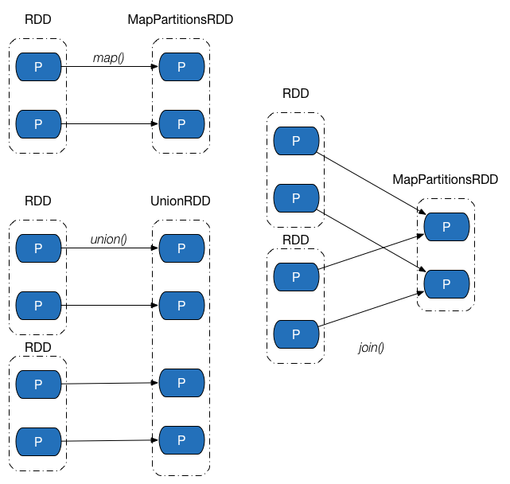
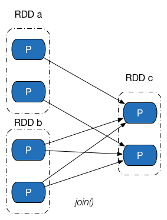
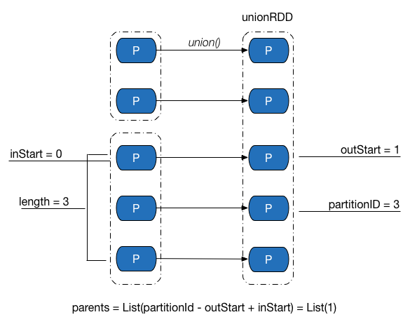
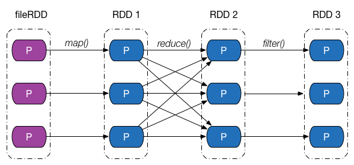
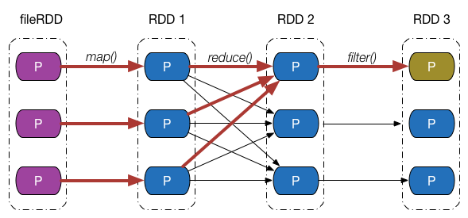
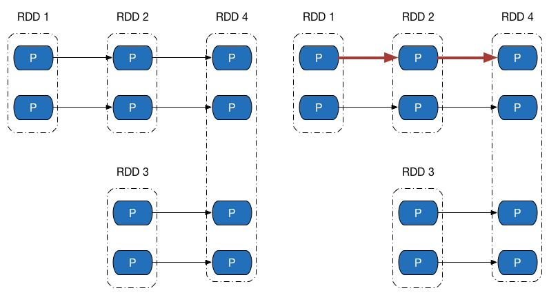
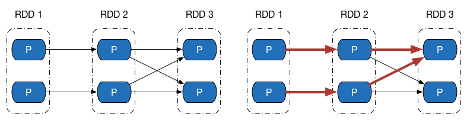

# RDD 依赖
## 依赖与 RDD
RDD 的容错机制是通过记录更新来实现的，且记录的是粗粒度的转换操作。在外部，我们将记录的信息称为__血统（Lineage）关系__，而到了源码级别，Apache Spark 记录的则是 RDD 之间的__依赖（Dependency）__关系。在一次转换操作中，创建得到的新 RDD 称为子 RDD，提供数据的 RDD 称为父 RDD，父 RDD 可能会存在多个，我们把子 RDD 与父 RDD 之间的关系称为依赖关系，或者可以说是子 RDD 依赖于父 RDD。
依赖只保存父 RDD 信息，转换操作的其他信息，如数据处理函数，会在创建 RDD 时候，保存在新的 RDD 内。依赖在 Apache Spark 源码中的对应实现是 `Dependency` 抽象类。

``` scala
/**
 * :: DeveloperApi ::
 * Base class for dependencies.
 */
@DeveloperApi
abstract class Dependency[T] extends Serializable {
  def rdd: RDD[T]
}
```

每个 `Dependency` 子类内部都会存储一个 `RDD` 对象，对应一个父 RDD，如果一次转换转换操作有多个父 RDD，就会对应产生多个 `Dependency` 对象，所有的 `Dependency` 对象存储在子 RDD 内部，通过遍历 RDD 内部的 `Dependency` 对象，就能获取该 RDD 所有依赖的父 RDD。

## 一些思考

RDD 被设计成内部数据不可改变和粗粒度转换，一个很主要的原因就是为了方便跟踪不同版本的数据集的依赖关系。但在我看来，即使没有这两个特性，RDD 应该也能记录依赖关系：

1. 若是数据可变，在单个 RDD 之内，保存所有的变动记录。
2. 若是细粒度，保存每一个数据变动时所使用的操作函数。

如此同样能够实现数据的并行计算和容错机制，但需要存储的数据量（单个 RDD 存储的数据量实在是太大了）、实现的复杂度都会大幅度增加，且很大程度上，没有这个必要，起码 Apache Spark 目前能够胜任大多数数据处理工作，提供的接口也比 Apache Hadoop 的 MR 要高层不少。

## 依赖分类
Apache Spark 将依赖进一步分为两类，分别是__窄依赖（Narrow Dependency）__和 __Shuffle 依赖（Shuffle Dependency，在部分文献中也被称为 Wide Dependency，即宽依赖）__。

窄依赖中，父 RDD 中的一个分区最多只会被子 RDD 中的一个分区使用，换句话说，父 RDD 中，一个分区内的数据是不能被分割的，必须整个交付给子 RDD 中的一个分区。下图展示了几类常见的窄依赖及其对应的转换操作。



Shuffle 依赖中，父 RDD 中的分区可能会被多个子 RDD 分区使用。因为父 RDD 中一个分区内的数据会被分割，发送给子 RDD 的所有分区，因此 Shuffle 依赖也意味着父 RDD 与子 RDD 之间存在着 Shuffle 过程。下图展示了几类常见的Shuffle依赖及其对应的转换操作。



依赖关系是两个 RDD 之间的依赖，因此若一次转换操作中父 RDD 有多个，则可能会同时包含窄依赖和 Shuffle 依赖，下图所示的 `Join` 操作，RDD a 和 RDD c 采用了相同的分区器，两个 RDD 之间是窄依赖，Rdd b 的分区器与 RDD c 不同，因此它们之间是 Shuffle 依赖，具体实现可参见 `CoGroupedRDD` 类的 `getDependencies` 方法。这里能够再次发现：__一个依赖对应的是两个 RDD，而不是一次转换操作。__



``` scala
  override def getDependencies: Seq[Dependency[_]] = {
    rdds.map { rdd: RDD[_ <: Product2[K, _]] =>
      /* I: Partitioner 相同，则是 OneToOneDepdencency */
      if (rdd.partitioner == Some(part)) {
        logDebug("Adding one-to-one dependency with " + rdd)
        new OneToOneDependency(rdd)
      } else {
        /* I: Partitioner 不同，则是 ShuffleDependency */
        logDebug("Adding shuffle dependency with " + rdd)
        new ShuffleDependency[K, Any, CoGroupCombiner](rdd, part, serializer)
      }
    }
  }
```

## 窄依赖
窄依赖的实现在 `NarrowDependency` 抽象类中。

``` scala
/**
 * :: DeveloperApi ::
 * Base class for dependencies where each partition of the child RDD depends on a small number
 * of partitions of the parent RDD. Narrow dependencies allow for pipelined execution.
 */
@DeveloperApi
abstract class NarrowDependency[T](_rdd: RDD[T]) extends Dependency[T] {
  /**
   * Get the parent partitions for a child partition.
   * @param partitionId a partition of the child RDD
   * @return the partitions of the parent RDD that the child partition depends upon
   */
  def getParents(partitionId: Int): Seq[Int]

  override def rdd: RDD[T] = _rdd
}
```

`NarrowDependency` 要求子类实现 `getParent` 方法，用于获取一个分区数据来源于父 RDD 中的哪些分区（虽然要求返回 `Seq[Int]`，实际上却只有一个元素）。

窄依赖可进一步分类成一对一依赖和范围依赖，对应实现分别是 `OneToOneDependency` 类和`RangeDependency` 类。

### 一对一依赖
一对一依赖表示子 RDD 分区的编号与父 RDD 分区的编号完全一致的情况，若两个 RDD 之间存在着一对一依赖，则子 RDD 的分区个数、分区内记录的个数都将继承自父 RDD。

一对一依赖的实现很简单，如下所示。

``` scala
/**
 * :: DeveloperApi ::
 * Represents a one-to-one dependency between partitions of the parent and child RDDs.
 */
@DeveloperApi
class OneToOneDependency[T](rdd: RDD[T]) extends NarrowDependency[T](rdd) {
  override def getParents(partitionId: Int) = List(partitionId)
}
```

### 范围依赖
范围依赖是依赖关系中的一个特例，只被用于表示 `UnionRDD` 与父 RDD 之间的依赖关系。相比一对一依赖，除了第一个父 RDD，其他父 RDD 和子 RDD 的分区编号不再一致，Apache Spark 统一将`unionRDD` 与父 RDD 之间（包含第一个 RDD）的关系都叫做范围依赖。范围依赖的实现如下。

``` scala
/**
 * :: DeveloperApi ::
 * Represents a one-to-one dependency between ranges of partitions in the parent and child RDDs.
 * @param rdd the parent RDD
 * @param inStart the start of the range in the parent RDD
 * @param outStart the start of the range in the child RDD
 * @param length the length of the range
 */
@DeveloperApi
  class RangeDependency[T](rdd: RDD[T], inStart: Int, outStart: Int, length: Int)
  extends NarrowDependency[T](rdd) {

  override def getParents(partitionId: Int) = {
    if (partitionId >= outStart && partitionId < outStart + length) {
      List(partitionId - outStart + inStart)
    } else {
      Nil
    }
  }
}
```

`RangeDepdencency` 类中 `getParents` 的一个示例如下图所示，对于 `UnionRDD` 中编号为 3 的分区，可以计算得到其数据来源于父 RDD 中编号为 1 的分区。



## Shuffle 依赖
Shuffle 依赖的对应实现为 `ShuffleDependency` 类，其源码如下。

```scala
/**
 * :: DeveloperApi ::
 * Represents a dependency on the output of a shuffle stage. Note that in the case of shuffle,
 * the RDD is transient since we don't need it on the executor side.
 *
 * @param _rdd the parent RDD
 * @param partitioner partitioner used to partition the shuffle output
 * @param serializer [[org.apache.spark.serializer.Serializer Serializer]] to use. If set to None,
 *                   the default serializer, as specified by `spark.serializer` config option, will
 *                   be used.
 */
@DeveloperApi
class ShuffleDependency[K, V, C](
    @transient _rdd: RDD[_ <: Product2[K, V]],
val partitioner: Partitioner,
val serializer: Option[Serializer] = None,
    val keyOrdering: Option[Ordering[K]] = None,
    val aggregator: Option[Aggregator[K, V, C]] = None,
    val mapSideCombine: Boolean = false)
  extends Dependency[Product2[K, V]] {

  override def rdd = _rdd.asInstanceOf[RDD[Product2[K, V]]]

  val shuffleId: Int = _rdd.context.newShuffleId()

  val shuffleHandle: ShuffleHandle = _rdd.context.env.shuffleManager.registerShuffle(
      shuffleId, _rdd.partitions.size, this)

  _rdd.sparkContext.cleaner.foreach(_.registerShuffleForCleanup(this))
}
```

`ShuffleDependency` 类中几个成员的作用如下：

- `rdd`：用于表示 Shuffle 依赖中，子 RDD 所依赖的父 RDD。
- `shuffleId`：Shuffle 的 ID 编号，在一个 Spark 应用程序中，每个 Shuffle 的编号都是唯一的。
- `shuffleHandle`：Shuffle 句柄，`ShuffleHandle` 内部一般包含 Shuffle ID、Mapper 的个数以及对应的 Shuffle 依赖，在执行 `ShuffleMapTask` 时候，任务可以通过 `ShuffleManager` 获取得到该句柄，并进一步得到 Shuffle 相关信息。
- `partitioner`：分区器，用于决定 Shuffle 过程中 Reducer 的个数（实际上是子 RDD 的分区个数）以及 Map 端的一条数据记录应该分配给哪一个 Reducer，也可以被用在 `CoGroupedRDD` 中，确定父 RDD 与子 RDD 之间的依赖关系类型。
- `serializer`：序列化器。用于 Shuffle 过程中 Map 端数据的序列化和 Reduce 端数据的反序列化。
- `KeyOrdering`：键值排序策略，用于决定子 RDD 的一个分区内，如何根据键值对 <K, V> 类型数据记录进行排序。
- `Aggregator`：聚合器，内部包含了多个聚合函数，比较重要的函数有 `createCombiner：V => C`，`mergeValue: (C, V) => C` 以及 `mergeCombiners: (C, C) => C`。例如，对于 `groupByKey` 操作，`createCombiner` 表示把第一个元素放入到集合中，`mergeValue` 表示一个元素添加到集合中，`mergeCombiners` 表示把两个集合进行合并。这些函数被用于 Shuffle 过程中数据的聚合。
- `mapSideCombine`：用于指定 Shuffle 过程中是否需要在 map 端进行 combine 操作。如果指定该值为 `true`，由于 combine 操作需要用到聚合器中的相关聚合函数，因此 `Aggregator` 不能为空，否则 Apache Spark 会抛出异常。例如：`groupByKey` 转换操作对应的`ShuffleDependency` 中，`mapSideCombine = false`，而 `reduceByKey` 转换操作中，`mapSideCombine = true`。

## 依赖与容错机制
介绍完依赖的类别和实现之后，回过头来，从分区的角度继续探究 Apache Spark 是如何通过依赖关系来实现容错机制的。下图给出了一张依赖关系图，`fileRDD` 经历了 `map`、`reduce` 以及`filter` 三次转换操作，得到了最终的 RDD，其中，`map`、`filter` 操作对应的依赖为窄依赖，`reduce` 操作对应的是 Shuffle 依赖。



假设最终 RDD 第一块分区内的数据因为某些原因丢失了，由于 RDD 内的每一个分区都会记录其对应的父 RDD 分区的信息，因此沿着下图所示的依赖关系往回走，我们就能找到该分区数据最终来源于 `fileRDD` 的所有分区，再沿着依赖关系往后计算路径中的每一个分区数据，即可得到丢失的分区数据。




这个例子并不是特别严谨，按照我们的思维，只有执行了持久化，存储在存储介质中的 RDD 分区才会出现数据丢失的情况，但是上例中最终的 RDD 并没有执行持久化操作。事实上，Apache Spark 将没有被持久化数据重新被计算，以及持久化的数据第一次被计算，也等价视为数据“丢失”，在 1.7 节中我们会看到这一点。

## 依赖与并行计算
在上一节中我们看到，在 RDD 中，可以通过__计算链（Computing Chain）__来计算某个 RDD 分区内的数据，我们也知道分区是并行计算的基本单位，这时候可能会有一种想法：能否把 RDD 每个分区内数据的计算当成一个并行任务，每个并行任务包含一个计算链，将一个计算链交付给一个 CPU 核心去执行，集群中的 CPU 核心一起把 RDD 内的所有分区计算出来。

答案是可以，这得益于 RDD 内部分区的数据依赖相互之间并不会干扰，而 Apache Spark 也是这么做的，但在实现过程中，仍有很多实际问题需要去考虑。进一步观察窄依赖、Shuffle 依赖在做并行计算时候的异同点。

先来看下方左侧的依赖图，依赖图中所有的依赖关系都是窄依赖（包括一对一依赖和范围依赖），可以看到，不仅计算链是独立不干扰的（所以可以并行计算），所有计算链内的每个分区单元的计算工作也不会发生重复，如右侧的图所示。这意味着除非执行了持久化操作，否则计算过程中产生的中间数据我们没有必要保留 —— 因为当前分区的数据只会给计算链中的下一个分区使用，而不用专门保留给其他计算链使用。



再来观察 Shuffle 依赖的计算链，如图下方左侧的图中，既有窄依赖，又有 Shuffle 依赖，由于 Shuffle 依赖中，子 RDD 一个分区的数据依赖于父 RDD 内所有分区的数据，当我们想计算末 RDD 中一个分区的数据时，Shuffle 依赖处需要把父 RDD 所有分区的数据计算出来，如右侧的图所示（紫色表示最后两个分区计算链共同经过的地方） —— 而这些数据，在计算末 RDD 另外一个分区的数据时候，同样会被用到。



如果我们做到计算链的并行计算的话，这就意味着，要么 Shuffle 依赖处父 RDD 的数据在每次需要使用的时候都重复计算一遍，要么想办法把父 RDD 数据保存起来，提供给其余分区的数据计算使用。

Apache Spark 采用的是第二种办法，但保存数据的方法可能与想象中的会有所不同，__Spark 把计算链从 Shuffle 依赖处断开__，划分成不同的__阶段（Stage）__，阶段之间存在依赖关系（其实就是 Shuffle 依赖），从而可以构建一张不同阶段之间的__有向无环图（DAG）__。这部分的内容我会在调度一章中细述。

# 参考资料
1. [Job 逻辑执行图 |  Apache Spark 的设计与实现](http://spark-internals.books.yourtion.com/markdown/2-JobLogicalPlan.html)