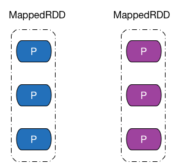

# RDD 分区
## 分区
先回答第一个问题：RDD 内部，如何表示并行计算的一个计算单元。答案是使用__分区（Partition）__。

RDD 内部的数据集合在逻辑上和物理上被划分成多个小子集合，这样的每一个子集合我们将其称为分区，分区的个数会决定并行计算的粒度，而每一个分区数值的计算都是在一个单独的任务中进行，因此并行任务的个数，也是由 RDD（实际上是一个阶段的末 RDD，调度章节会介绍）分区的个数决定的，我会在 1.2 小节以及第二章中，具体说明分区与并行计算的关系。

在后文中，我会用下图所示图形来表示 RDD 以及 RDD 内部的分区，RDD 上方文字表示该 RDD 的类型或者名字，分区颜色为紫红色表示该 RDD 内数据被缓存到存储介质中，蓝色表示该 RDD 为普通 RDD。 —— 话说这配色真的很丑么……



## 分区实现

分区的源码实现为 `Partition` 类。

``` scala
/**
 * An identifier for a partition in an RDD.
 */
trait Partition extends Serializable {
  /**
   * Get the partition's index within its parent RDD
   */
  def index: Int

  // A better default implementation of HashCode
  override def hashCode(): Int = index
}
```

RDD 只是数据集的抽象，分区内部并不会存储具体的数据。`Partition` 类内包含一个 `index` 成员，表示该分区在 RDD 内的编号，通过 RDD 编号 + 分区编号可以唯一确定该分区对应的块编号，利用底层数据存储层提供的接口，就能从存储介质（如：HDFS、Memory）中提取出分区对应的数据。

`RDD` 抽象类中定义了 `_partitions` 数组成员和 `partitions` 方法，`partitions` 方法提供给外部开发者调用，用于获取 RDD 的所有分区。`partitions` 方法会调用内部 `getPartitions` 接口，`RDD` 的子类需要自行实现 `getPartitions` 接口。

```scala
  @transient private var partitions_ : Array[Partition] = null

  /**
   * Implemented by subclasses to return the set of partitions in this RDD. This method will only
   * be called once, so it is safe to implement a time-consuming computation in it.
   */
  protected def getPartitions: Array[Partition]

  /**
   * Get the array of partitions of this RDD, taking into account whether the
   * RDD is checkpointed or not.
   */
  final def partitions: Array[Partition] = {
    checkpointRDD.map(_.partitions).getOrElse {
      if (partitions_ == null) {
        partitions_ = getPartitions
      }
      partitions_
    }
  }
```

以 `map` 转换操作生成 `MapPartitionsRDD` 类中的 `getPartitions` 方法为例。
 
``` scala
  override def getPartitions: Array[Partition] = firstParent[T].partitions
```

可以看到，`MapPartitionsRDD` 的分区实际上与父 RDD 的分区完全一致，这也符合我们对 `map` 转换操作的认知。

## 分区个数
RDD 分区的一个分配原则是：尽可能使得分区的个数，等于集群核心数目。

RDD 可以通过创建操作或者转换操作得到。转换操作中，分区的个数会根据转换操作对应多个 RDD 之间的依赖关系确定，窄依赖子 RDD 由父 RDD 分区个数决定，Shuffle 依赖由子 RDD 分区器决定。

创建操作中，程序开发者可以手动指定分区的个数，例如 `sc.parallelize (Array(1, 2, 3, 4, 5), 2)` 表示创建得到的 RDD 分区个数为 2，在没有指定分区个数的情况下，Spark 会根据集群部署模式，来确定一个分区个数默认值。

分别讨论 `parallelize` 和`textFile` 两种通过外部数据创建生成RDD的方法。

对于 `parallelize` 方法，默认情况下，分区的个数会受 Apache Spark 配置参数 `spark.default.parallelism` 的影响，官方对该参数的解释是用于控制 Shuffle 过程中默认使用的任务数量，这也符合我们之间对分区个数与任务个数之间关系的理解。

``` scala
  /** Distribute a local Scala collection to form an RDD.
   *
   * @note Parallelize acts lazily. If `seq` is a mutable collection and is altered after the call
   * to parallelize and before the first action on the RDD, the resultant RDD will reflect the
   * modified collection. Pass a copy of the argument to avoid this.
   * @note avoid using `parallelize(Seq())` to create an empty `RDD`. Consider `emptyRDD` for an
   * RDD with no partitions, or `parallelize(Seq[T]())` for an RDD of `T` with empty partitions.
   */
  def parallelize[T: ClassTag](
      seq: Seq[T],
      numSlices: Int = defaultParallelism): RDD[T] = withScope {
    assertNotStopped()
    new ParallelCollectionRDD[T](this, seq, numSlices, Map[Int, Seq[String]]())
  }
```

无论是以本地模式、Standalone 模式、Yarn 模式或者是 Mesos 模式来运行 Apache Spark，分区的默认个数等于对 `spark.default.parallelism` 的指定值，若该值未设置，则 Apache Spark 会根据不同集群模式的特征，来确定这个值。

对于本地模式，默认分区个数等于本地机器的 CPU 核心总数（或者是用户通过 `local[N]` 参数指定分配给 Apache Spark 的核心数目，见 `LocalBackend` 类），显然这样设置是合理的，因为把每个分区的计算任务交付给单个核心执行，能够保证最大的计算效率。

``` scala
  override def defaultParallelism() =
    scheduler.conf.getInt("spark.default.parallelism", totalCores)
```

若使用 Apache Mesos 作为集群的资源管理系统，默认分区个数等于 8（对 Apache Mesos 不是很了解，根据这个 `TODO`，个人猜测 Apache Spark 暂时还无法获取 Mesos 集群的核心总数）（见 `MesosSchedulerBackend` 类）。

``` scala
  // TODO: query Mesos for number of cores
  override def defaultParallelism(): Int = sc.conf.getInt("spark.default.parallelism", 8)
```

其他集群模式（Standalone 或者 Yarn），默认分区个数等于集群中所有核心数目的总和，或者 2，取两者中的较大值（见 `CoarseGrainedSchedulerBackend` 类）。

``` scala
  override def defaultParallelism(): Int = {
    conf.getInt("spark.default.parallelism", math.max(totalCoreCount.get(), 2))
  }
```

对于 `textFile` 方法，默认分区个数等于 `min(defaultParallelism, 2)`（见 `SparkContext` 类），而 `defaultParallelism` 实际上就是 `parallelism` 方法的默认分区值。

``` scala
  /**
   * Read a text file from HDFS, a local file system (available on all nodes), or any
   * Hadoop-supported file system URI, and return it as an RDD of Strings.
   */
  def textFile(
      path: String,
      minPartitions: Int = defaultMinPartitions): RDD[String] = withScope {
    assertNotStopped()
    hadoopFile(path, classOf[TextInputFormat], classOf[LongWritable], classOf[Text],
      minPartitions).map(pair => pair._2.toString)
  }
```


## 分区内部记录个数
分区分配的另一个分配原则是：尽可能使同一 RDD 不同分区内的记录的数量一致。

对于转换操作得到的 RDD，如果是窄依赖，则分区记录数量依赖于父 RDD 中相同编号分区是如何进行数据分配的，如果是 Shuffle 依赖，则分区记录数量依赖于选择的分区器，哈希分区器无法保证数据被平均分配到各个分区，而范围分区器则能做到这一点。这部分内容我会在 1.6 小节中讨论。

`parallelize` 方法通过把输入的数组做一次平均分配，尝试着让每个分区的记录个数尽可能大致相同（见 `ParallelCollectionRDD` 类）。

``` scala
private object ParallelCollectionRDD {
  /**
   * Slice a collection into numSlices sub-collections. One extra thing we do here is to treat Range
   * collections specially, encoding the slices as other Ranges to minimize memory cost. This makes
   * it efficient to run Spark over RDDs representing large sets of numbers. And if the collection
   * is an inclusive Range, we use inclusive range for the last slice.
   */
  def slice[T: ClassTag](seq: Seq[T], numSlices: Int): Seq[Seq[T]] = {
    if (numSlices < 1) {
      throw new IllegalArgumentException("Positive number of slices required")
    }
    // Sequences need to be sliced at the same set of index positions for operations
    // like RDD.zip() to behave as expected
    def positions(length: Long, numSlices: Int): Iterator[(Int, Int)] = {
      (0 until numSlices).iterator.map(i => {
        val start = ((i * length) / numSlices).toInt
        val end = (((i + 1) * length) / numSlices).toInt
        (start, end)
      })
    }
    seq match {
      case r: Range => {
        positions(r.length, numSlices).zipWithIndex.map({ case ((start, end), index) =>
          // If the range is inclusive, use inclusive range for the last slice
          if (r.isInclusive && index == numSlices - 1) {
            new Range.Inclusive(r.start + start * r.step, r.end, r.step)
          }
          else {
            new Range(r.start + start * r.step, r.start + end * r.step, r.step)
          }
        }).toSeq.asInstanceOf[Seq[Seq[T]]]
      }
      case nr: NumericRange[_] => {
        // For ranges of Long, Double, BigInteger, etc
        val slices = new ArrayBuffer[Seq[T]](numSlices)
        var r = nr
        for ((start, end) <- positions(nr.length, numSlices)) {
          val sliceSize = end - start
          slices += r.take(sliceSize).asInstanceOf[Seq[T]]
          r = r.drop(sliceSize)
        }
        slices
      }
      case _ => {
        val array = seq.toArray // To prevent O(n^2) operations for List etc
        positions(array.length, numSlices).map({
          case (start, end) =>
            array.slice(start, end).toSeq
        }).toSeq
      }
    }
  }
}
```

`textFile` 方法分区内数据的大小则是由 Hadoop API 接口 `FileInputFormat.getSplits` 方法决定（见 `HadoopRDD` 类），得到的每一个分片即为 RDD 的一个分区，分片内数据的大小会受文件大小、文件是否可分割、HDFS 中块大小等因素的影响，但总体而言会是比较均衡的分配。

``` scala
  override def getPartitions: Array[Partition] = {
    val jobConf = getJobConf()
    // add the credentials here as this can be called before SparkContext initialized
    SparkHadoopUtil.get.addCredentials(jobConf)
    val inputFormat = getInputFormat(jobConf)
    if (inputFormat.isInstanceOf[Configurable]) {
      inputFormat.asInstanceOf[Configurable].setConf(jobConf)
    }
    val inputSplits = inputFormat.getSplits(jobConf, minPartitions)
    val array = new Array[Partition](inputSplits.size)
    for (i <- 0 until inputSplits.size) {
      array(i) = new HadoopPartition(id, i, inputSplits(i))
    }
    array
  }
```
## 参考资料
1. [Spark Configuration - Spark 1.2.0 Documentation](https://spark.apache.org/docs/1.2.0/configuration.html)
2. [FileInputFormat (Apache Hadoop Main 2.6.0 API)](https://hadoop.apache.org/docs/r2.6.0/api/org/apache/hadoop/mapred/FileInputFormat.html)
3. [Spark：RDD 理解](http://dtstar.cn/Understanding%20RDD/)