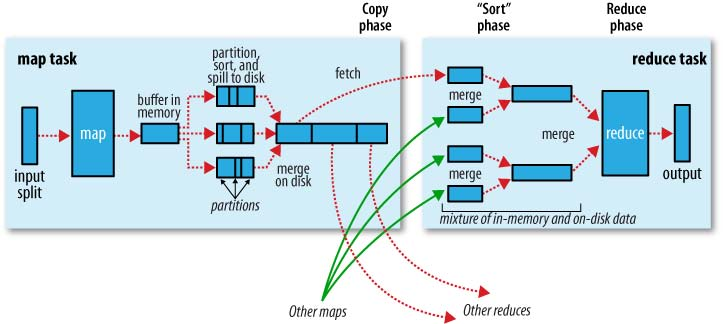
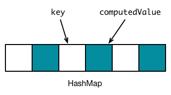
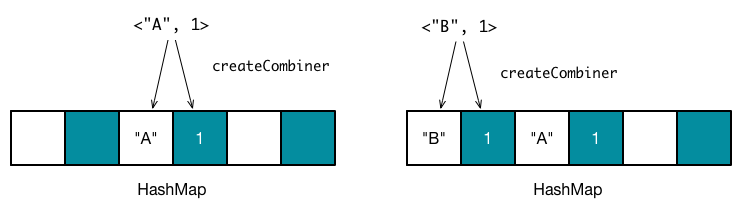
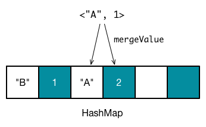
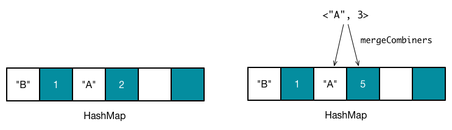

# Shuffle 过程

在前面的章节中，我们已经讨论过了在__同一个阶段内部__数据的流动过程，包括任务的切分和运行，调用 `iterator` 和 `compute` 方法自后向前获取和计算分区数据，等等。

而对于__相邻阶段之间__的数据传输，我曾在 [Shuffle 依赖](../section1/rddDependencies.html) 小节中有过简单提及：如果希望实现带 Shuffle 依赖的计算链中分区数据（或者说是任务）的并行计算，由于 Shuffle 依赖父 RDD 的同一个分区数据会被子 RDD 的所有分区重复使用，因此为了提高计算效率，当计算父 RDD 的一个分区数据完毕之后，Apache Spark 会把分区数据临时存储在文件系统中，提供给子 RDD 的分区去使用。

为了符合__子阶段需要等待父阶段执行完毕后子阶段才开始执行__这一特性，只有当 Shuffle 依赖中父 RDD 所有分区的数据被计算和存储完毕之后，子 RDD 才会开始去拉取需要的分区数据。我们将整个数据传输的过程称为 Apache Spark 的 __Shuffle 过程__。Shuffle 过程中，我们把一个分区数据计算完毕到数据被写入到磁盘的过程，称为 __Shuffle 写过程__。对应的，在子 RDD 某个分区计算的过程中，把所需的数据从父 RDD 拉取过来的过程，称为 __Shuffle 读过程__。

Apache Spark 的 Shuffle 过程与 Apache Hadoop 的 Shuffle 过程有着诸多类似，一些概念可直接套用，例如，Shuffle 过程中，提供数据的一端，被称作 Map 端，Map 端每个生成数据的任务称为 Mapper，对应的，接收数据的一端，被称作 Reduce 端，Reduce 端每个拉取数据的任务称为 Reducer，Shuffle 过程本质上都是__将 Map 端获得的数据使用分区器进行划分，并将数据发送给对应的 Reducer 的过程__。

## 与 Apache Hadoop 的区别
当然，Apache Spark 和 Apache Hadoop 毕竟不是同一套计算框架，其在 Shuffle 过程实现的细节上有着诸多不同。咱们先来温习下经典 MR 模型内的 Shuffle 过程。

### MR 模型的 Shuffle 过程



（图像来源：___Hadoop Definitive Guide___）

MR 模型中，每个 Mapper 维护一个环形内存缓冲区，用于存储任务输出，当内存缓冲区数据达到一定阈值时候，将缓冲区中的数据进行__分区（Partition）__，对于同一个分区内部的数据按照键值进行__排序（Sort）__，如果开发者指定了 `Combiner`，那么对于排序后的结果，还会执行一次__合并(Combine）__操作，最后的结果会被__溢存（Spill）__到磁盘文件中，在任务完成之前，Apache Hadoop 会采用__多路归并算法（K-way Merge Algorithm）__来__归并（Merge）__这几个内部有序的溢存文件，新文件中数据同样是有序的。

Reducer 需要从 Map 端拉取数据，当一个 Mapper 运行结束之后，会通知 JobTracker，Reducer 定期从 JobTracker 获取相关信息，然后从 Mapper 端获取数据，所有需要的数据复制完毕后，Reducer 会合并来自不同 Map 端拉取过来的数据，并将最后排序好的数据送往 `Reduce` 方法处理。

### 聚合器

Apache Hadoop 和 Apache Spark 各自的 Shuffle 机制里，比较重要的一个区别在于数据的__聚合（Aggregation）__和聚合数据的计算。对于 Apache Hadoop，聚合是通过对同一分区内的数据按照键值排序，键值相同的数据会彼此相邻，从而达到聚合的目的，而聚合后的数据会被交给 `combine`（Map 端）和 `reduce`（Reduce 端）函数去处理。对于 Apache Spark，聚合以及数据计算的过程，则是交付给__聚合器（Aggregator）__去处理。

聚合器我在 [Shuffle 依赖](../section1/rddDependencies.html) 小节介绍 `ShuffleDependency` 类时候曾经简单提及过，实例化一个聚合器的时候，需要提供三个函数，分别是：`createCombiner: V => C`，`mergeValue: (C, V) => C` 以及 `mergeCombiners: (C, C) => C`。我们以单词统计程序中的 `reduceByKey(_ + _)` 转换操作为例，介绍这三个函数究竟是如何实现数据的聚合和计算的。

Apache Spark 会使用哈希表来存储所有聚合数据的处理结果，表中的浅色空槽用于存储键值，右侧相邻深色空槽表示该键值对应的计算值。聚合器开始处理聚合数据之前，哈希表是空的，如下图所示。



假设需要聚合的数据是 <"A", 1>，<"B", 1>，<"A", 1>，需要注意，这时候数据是__无序__的。对于第一个数据，<"A", 1>，Apache Spark 会通过散列函数计算键值 "A" 对应的哈希表地址，假设此时得到的哈希值为 1，因此哈希表中，地址为 2 的空槽用于存放键值 "A"，地址 为 3 的空槽用于存放计算后的值。__由于地址为 2 和地址为 3 的槽均为空槽，这时候会调用 `createCombiner(kv._2)` 函数来计算初始值__。对于 `reduceByKey` 转换操作， `createCombiner` 实际为 `(v: V) => v`，因此得到计算值为 1，将 "A" 放入到地址为 2 的空槽中，将 1 放入到地址为 3 的插槽中。同理，对于数据 <"B", 1>，可以放入到另外两个空槽中。



第三个数据是 <"A", 1>，计算得到地址为 1，此时__因为地址为 2 和 地址为 3 的插槽已经有值 `oldValue`，这时候调用 `mergeValue(oldValue, kv._2)` 来计算新的值。__ 对于 `reduceByKey` 转换操作，`mergeValue` 实际上为用户在调用 `reduceBykey` 时候指定的函数，在本例中，该函数为 `_ + _`，因此得到新的值 2，更新地址为 3 的槽。



`reduceByKey` 指定了 `Combiner`，因此会在 Map 端执行结合操作，Reducer 接收到的键值对数据，值的类型会是 `C` 而非 `V`（尽管在本例中，`C` 和 `V` 是相同类型），__这时候如果键值对应的槽为空槽，直接插入 `kc._2`，否则调用 `mergeCombiners(oldValue, kc._2)` 函数来计算新的值__。对于 `reduceByKey` 转换操作，`mergeCombiners` 实际为用户在调用 `reduceBykey` 时候指定的函数。



到此为止，数据已经被成功地聚合和计算了，当然在实际的过程中需要考虑的问题还很多，例如哈希表冲突解决、大小分配、内存限制等等。Apache Spark 实现了两类哈希表，分别是 `AppendOnlyMap` 和 `ExternalAppendOnlyMap`，我会在后面专门用一节内容，来介绍这两类哈希表的特性和实现。

接下来，我们思考下其与 MR 机制中聚合 - 计算过程的区别。首先，最明显的区别是，Apache Spark 的聚合 - 计算过程__不需要进行任何排序！！！__这意味着 Apache Spark 节省了排序所消耗的大量时间，代价是最后得到的分区内部数据是无序的；再者，Apache Spark 的聚合 / 计算过程是__同步进行__的，聚合完毕，结果也计算出来，而 Apache Hadoop 需要等聚合完成之后，才能开始数据的计算过程；最后，Apache Spark 将所有的计算操作都限制在了 `createCombiner`、`mergeValue` 以及 `mergeCombiners` 之内，在灵活性之上显然要弱于 Apache Hadoop，例如，Apache Spark 很难通过一次聚合 - 计算过程求得平均数。

### 哈希 Shuffle 与排序 Shuffle

__注：本节内容存在些许较为严重的理解错误，因近期求职较忙，一直未来得及修正，希望没有误导到各位读者，实在是抱歉。__

在 1.1 之前的版本，Apache Spark 仅提供了__哈希 Shuffle（Hash-Based Shuffle）机制__，其实现同我们前面所述的聚合 / 计算过程基本一致，然而如我们上一小节所说的，聚合 / 计算过程后，分区内部的数据是无序的，如果开发者希望有序，就需要调用排序相关的转换操作，例如 `sortBy`、`sortByKey` 等等；再者，哈希 Shuffle 强制要求在 Map 端进行 Combine 操作，对于某些键值重复率不高的数据，Combine 操作反倒会影响效率；另外，哈希 Shuffle 每个 Mapper 会针对每个 Reducer 生成一个数据文件，当 Mapper 和 Reducer 数量比较多的时候，会导致磁盘上生成大量的文件（___为什么不将所有数据放到一个文件里面，并额外生成一个索引文件用于分区的索引呢？___）。

从 1.1 开始，Apache Spark 提供了另一套 Shuffle 机制 —— __排序 Shuffle（Sort-Based Shuffle）__，并且从 1.2 版本开始，把排序 Shuffle 作为默认的 Shuffle 机制，用户可以将配置项 `spark.shuffle.manager` 设置为 `hash` 或者 `sort`，来使用对应的 Shuffle 机制。排序 Shuffle 相比哈希 Shuffle，两者的 Shuffle 读过程是完全一致的，唯一区别在 Shuffle 写过程。

排序 Shuffle 允许 Map 端不进行 `Combine` 操作，这意味着在不指定 `Combiner` 的情况下，排序 Shuffle 机制 Map 端不能使用一张哈希表来存储数据，而是改为用__数据缓存区（Buffer）__存储所有的数据。对于指定 `Combiner` 的情况下，排序 Shuffle 仍然使用哈希表存储数据，Combine 过程与哈希 Shuffle 基本一致。无论是 Buffer 还是 HashMap，每更新一次，都会检查是否需要将现有的数据溢存到磁盘当中，需要的话，__就对数据进行排序__，存储到一个文件中，当所有的数据都更新完毕之后，执行结合操作，把多个文件合并成一个文件，__并且保证每个分区内部数据是有序的__。

两类 Shuffle 机制的 Shuffle 读、Shuffle 写过程的实现我会在后面小节中具体讲解。

## Shuffle 过程
我们继续从源码的角度，了解 Apache Spark 是如何触发 Shuffle 写和 Shuffle 读过程的。

我们知道，Mapper 本质上就是一个任务。调度章节曾提及过 DAG 调度器会在一个阶段内部划分任务，根据阶段的不同，得到 `ResultTask` 和 `ShuffleMapTask` 两类任务。`ResultTask` 会将计算结果返回给 Driver，`ShuffleMapTask` 则将结果传递给 Shuffle 依赖中的子 RDD。因此我们可以从 `ShuffleMapTask` 入手，观察 Mapper 的大致工作流程。

```scala
private[spark] class ShuffleMapTask(
    stageId: Int,
    taskBinary: Broadcast[Array[Byte]],
    partition: Partition,
    @transient private var locs: Seq[TaskLocation])
  extends Task[MapStatus](stageId, partition.index) with Logging {
    // 省略部分源码
    override def runTask(context: TaskContext): MapStatus = {
	    // Deserialize the RDD using the broadcast variable.
	    val deserializeStartTime = System.currentTimeMillis()
	    val ser = SparkEnv.get.closureSerializer.newInstance()
	    val (rdd, dep) = ser.deserialize[(RDD[_], ShuffleDependency[_, _, _])](
	      ByteBuffer.wrap(taskBinary.value), Thread.currentThread.getContextClassLoader)
	    _executorDeserializeTime = System.currentTimeMillis() - deserializeStartTime    
	    try {
	      val manager = SparkEnv.get.shuffleManager
	      writer = manager.getWriter[Any, Any](dep.shuffleHandle, partitionId, context)
	      writer.write(rdd.iterator(partition, context).asInstanceOf[Iterator[_ <: Product2[Any, Any]]])
	      return writer.stop(success = true).get
	    } catch {
	      case e: Exception =>
	        // 省略部分源码
	    }
  }
}
```

由于一个任务对应当前阶段末 RDD 内的一个分区，因此通过 `rdd.iterator(partition, context)` 可以计算得到该分区的数据，这个过程我在 [RDD 计算函数](../section1/computeFunction.html) 小节中已经介绍过。接下来便是执行 Shuffle 写操作，该操作由一个 `ShuffleWriter` 实例通过调用 `write` 接口完成，Apache Spark 从 `ShuffleManager` 实例中获取该 `ShuffleWriter` 对象。

上文提及过，Apache Spark 提供了两类 Shuffle 机制，对应的， `ShuffleManager` 也有两类子类，分别是 `HashShuffleManager` 和 `SortShuffleManager`，__`ShuffleManager` 的主要作用是提供 `ShuffleWriter` 和 `ShuffleReader` 用于 Shuffle 写和 Shuffle 读过程__。`HashShuffleManager` 提供 `HashShuffleWriter` 和 `HashShuffleReader`，而 `SortShffleManager` 提供的是 `SortShuffleWriter` 和 `HashShuffleReader`，可以看到，__哈希 Shuffle 和排序 Shuffle 的唯一区别在于 Shuffle 写过程，读过程完全一致__。

继续来观察 Shuffle 读的触发。Apache Spark 中，聚合器中三个函数是在 `PairRDDFunctions.combineByKey` 方法中指定。可以看到，若新 RDD 与旧 RDD 的分区器不同时，会生成一个 `ShuffledRDD`。

```scala
  def combineByKey[C](createCombiner: V => C,
      mergeValue: (C, V) => C,
      mergeCombiners: (C, C) => C,
      partitioner: Partitioner,
      mapSideCombine: Boolean = true,
      serializer: Serializer = null): RDD[(K, C)] = self.withScope {
    // 省略部分代码
    val aggregator = new Aggregator[K, V, C](
      self.context.clean(createCombiner),
      self.context.clean(mergeValue),
      self.context.clean(mergeCombiners))
    if (self.partitioner == Some(partitioner)) {
      self.mapPartitions(iter => {
        val context = TaskContext.get()
        new InterruptibleIterator(context, aggregator.combineValuesByKey(iter, context))
      }, preservesPartitioning = true)
    } else {
      new ShuffledRDD[K, V, C](self, partitioner)
        .setSerializer(serializer)
        .setAggregator(aggregator)
        .setMapSideCombine(mapSideCombine)
    }   
  }   
```

观察 `ShuffledRDD` 是如何获取分区数据的。与 Shuffle 写过程类似，先从 `ShuffleManager` 中获取 `ShuffleReader`，通过 `ShuffleReader` 的 `read` 接口拉取和计算特定分区中的数据。

```scala
  override def compute(split: Partition, context: TaskContext): Iterator[(K, C)] = {
    val dep = dependencies.head.asInstanceOf[ShuffleDependency[K, V, C]]
    SparkEnv.get.shuffleManager.getReader(dep.shuffleHandle, split.index, split.index + 1, context)
      .read()
      .asInstanceOf[Iterator[(K, C)]]
  }
```

在后面小节中，我们会进一步分析 `ShuffleWriter.write` 和 `ShuffleReader.read` 的具体实现。

## 参考资料
1. [Shuffle 过程 | Apache Spark 的设计与实现](http://spark-internals.books.yourtion.com/markdown/4-shuffleDetails.html)
2. ___Hadoop Definitive Guide___